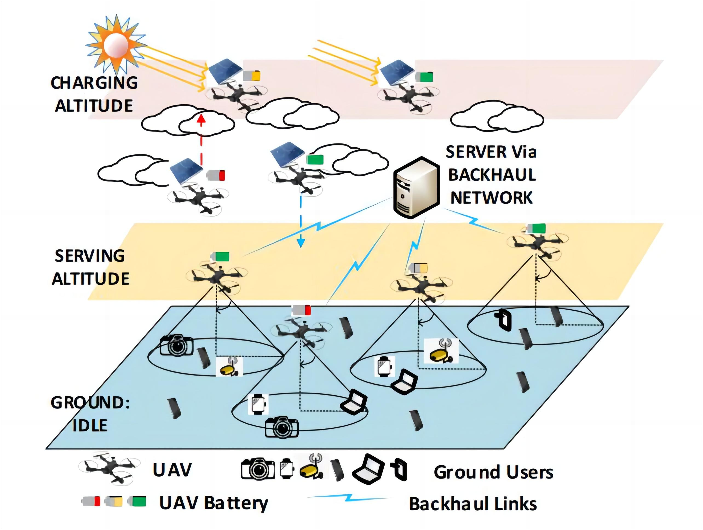
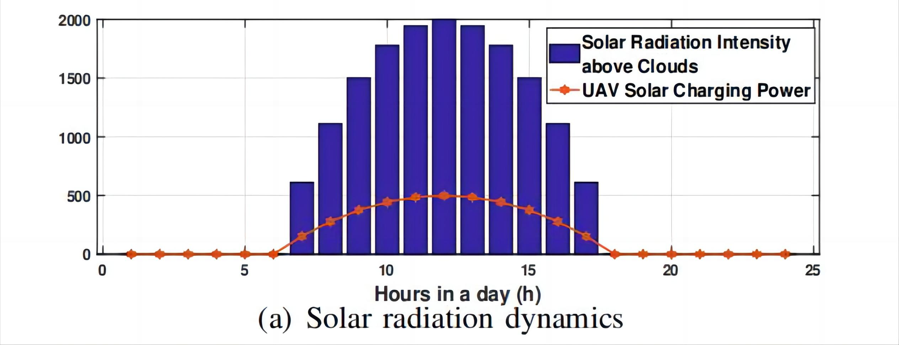
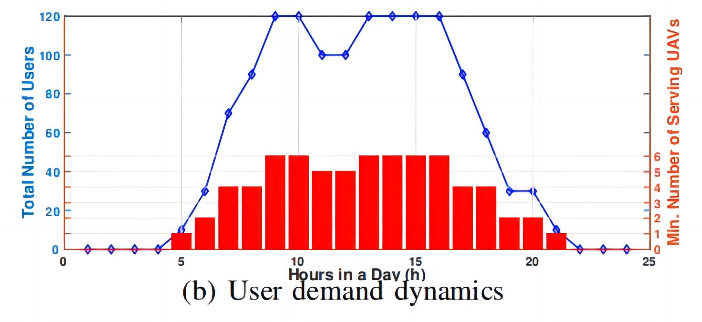
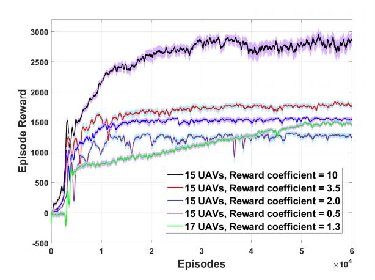
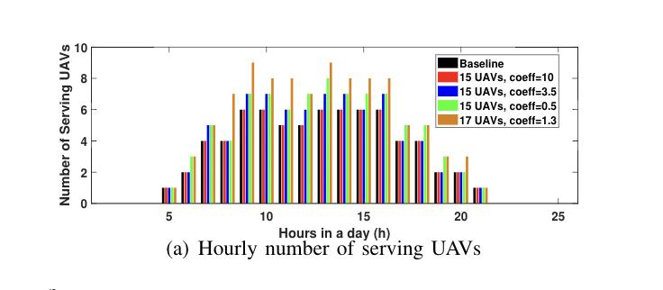

# Solar-Power-UAV-Communication-Networks-based-on-RL
This repository contains the official implementation for our paper:

**[Optimal Charging Profile Design for Solar-Powered Sustainable UAV Communication Networks](https://ieeexplore.ieee.org/abstract/document/10279806)**  
_Longxin Wang, Saugat Tripathi, Ran Zhang, Nan Cheng, Miao Wang_  
Published in *IEEE International Conference on Communication(ICC)*, 2023.

## 🖼️ Network Architecture


## 📊 Numerical Results
### 🔹 Solar radiation dynamics
The solar radiation is concentrated between 7am- 5pm in a day.

### 🔹 User demand dynamics
There are more users requesting services in the
late morning and afternoon, which is consistent
with daily working hours.
To satisfy a minimum 85% of user service rate
per hour, the red bars show the minimum number
of UAVs needed for serving

### 🔹 Convergence
Convergence of episodic reward for different numbers
of UAVs and reward coefficients (c1, c2). The episode
rewards are averaged over a window size of 300 with
95% credit interval.


### 🔹 Hourly number of serving UAVs


## 📁 Project Structure
- `DDPG 17UAV.py` - main script to run the 17 UAVs
- `UAVsolar17test` - Environment Setup
- `DDPG UAV15best.py` - main script to run the 15 UAVs
- `UAVsolar15test` - Environment Setup

## 🚀 Usage

### ▶️ Run with 17 UAVs:

```bash
python "DDPG 17UAV.py"
```
### ▶️ Run with 15 UAVs:
```bash
python "DDPG UAV15best.py"
```
